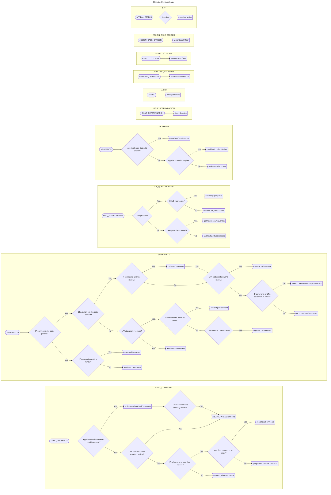

# Appeal action required logic

This document provides a reference for the logic that the web application uses to determine required actions for appeals.

## Required actions

Required actions represent specific user actions which can be performed by the user based on the current status and other data within the appeal. Because each required action may map to one or more types of user prompt or call to action (such as important notification banners on the case details page, and action links in the personal list), they are abstract and not tied to a specific use case. Some examples to illustrate:

| RequiredAction        | Important notification banner (case details page) | Personal list action    |
| --------------------- | ------------------------------------------------- | ----------------------- |
| 'startAppeal'         | 'Appeal valid and ready to start'                 | 'Start case'            |
| 'reviewAppellantCase' | 'Ready for validation'                            | 'Review appellant case' |
| 'arrangeSiteVisit'    | 'Site visit ready to set up'                      | 'Set up site visit'     |

Required actions are defined as a union of strings in the `AppealRequiredAction` type definition, found in `appeals/web/src/server/lib/mappers/utils/required-actions.js`, alongside the `getRequiredActionsForAppeal` which returns a list of required actions for a given input.

## Notification banners

There are two main types of notification banners defined in the GDS notification banner component ((documented here)[https://design-system.service.gov.uk/components/notification-banner/]), "important" and "success". Both of these are used in the appeals back office service. Individual use-case-specific banners are defined in the `notificationBannerDefinitions` object in `appeals/web/src/server/lib/mappers/components/page-components/notification-banners.mapper.js`. Each is associated with a specific key, defined in the `NotificationBannerDefinitionKey` type definition in the same file.

### Success

Success banners are stored in the session, and are displayed once only to indicate a user action was performed successfully, and then removed. For example, when a case officer is added or changed:

1. Open case details page for an appeal in 'ASSIGN CASE OFFICER' status (or should also work for any non-closed status)
2. Scroll down and expand 'Team' accordion
3. Click 'Add/Change' link in the 'Case officer' row
4. Search for your user account's email address (or any valid service user email)
5. Click 'Choose' link next to the result item
6. On the 'Assign this case officer' page, select 'Yes' and click 'Continue'
7. When you are redirected to the case details page, observe 'Success: Case officer has been assigned' notification banner

Success banners are not related to required actions.

### Important

Important banners are generated on page load by mapping code, and are persistent, because they are used to make the user aware of important information based on the current state of a case (or information within it). For example, when an appeal is ready for a case officer to be assigned:

1. Open case details page for an appeal in 'ASSIGN CASE OFFICER' status
2. Observe the 'Important: Appeal ready to be assigned to case officer' banner

Important banners are primarily displayed on the case details page, but some types appear on other pages, such as the appellant case and LPA questionnaire (which display important banners when reviewed as 'incomplete'). Notification banners of this type are generated based on required actions. Case details page 'important' banners are mapped by the lib function `mapStatusDependentNotifications` found in `appeals/web/src/server/lib/mappers/utils/map-status-dependent-notifications.js`. `RequiredAction`s are mapped to `NotificationBannerDefinitionKey`s using the `appealActionRequiredToNotificationBannerMapping` object defined in `appeals/web/src/server/lib/mappers/components/page-components/notification-banners.mapper.js`.

## Personal list actions

The personal list (a.k.a. 'Cases assigned to you') is accessed via the 'Assigned to me' primary navigation link in the header, and shows a list of all cases assigned to the current user. Personal list actions are the links and/or labels displayed in the 'Action required' column. Like important banners, these are also generated based on required actions. For example:

1. Assign yourself as the case officer for an appeal in 'ASSIGN CASE OFFICER' status (see steps in previous 'Notification banners -> Success' section)
2. Click 'Assigned to me' primary nav link in the header
3. Observe row for the case on the 'Cases assigned to you' page, which should now be in 'validation' status
4. Observe 'Review appellant case' link in the 'Action required' column for the appeal

The function `mapActionLinksForAppeal` in `appeals/web/src/server/appeals/personal-list/personal-list.mapper.js` maps the required actions for each appeal to an HTML string containing the action links (or sometimes just text labels). The actions are defined inline, rather than in a dictionary object with typed keys like the notification banners, as they are only used in the personal list mapper.

## Required actions logic

The logic used to determine the required actions for a given appeal is contained in `appeals/web/src/server/lib/mappers/utils/required-actions.js`. The `getRequiredActionsForAppeal` function is responsible for performing the actual mapping, and is called from `appeals/web/src/server/lib/mappers/utils/map-status-dependent-notifications.js` (for case details page 'important' notification banners), and also from `appeals/web/src/server/appeals/personal-list/personal-list.mapper.js`. The following flowcharts illustrate the specifics of the business logic in the `getRequiredActionsForAppeal` function:

