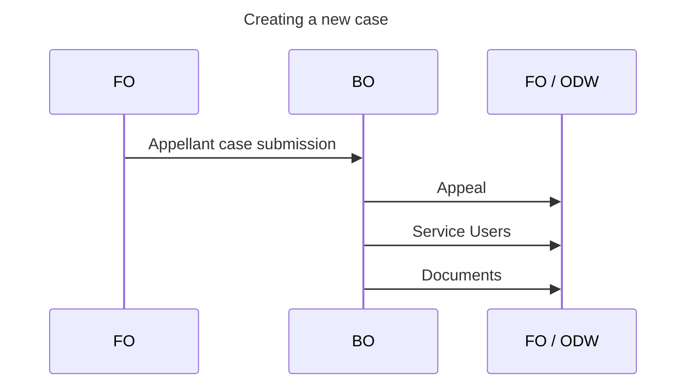
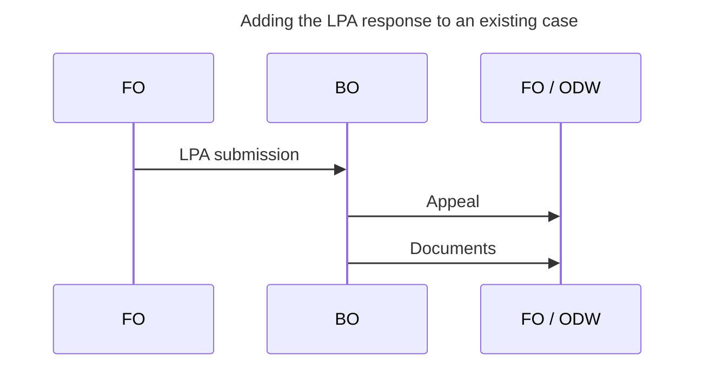

# Integrations

The Appeals Back-Office exchanges data with additional systems, including the Appeals Front-Office and the Operational Data Warehouse (ODW). The data is exchanged through a set of [Azure Service Bus topics](https://learn.microsoft.com/en-us/azure/service-bus-messaging/service-bus-queues-topics-subscriptions#topics-and-subscriptions), each topic representing an individual data entity, validated against the JSON schemas available in the [data model repository](https://github.com/Planning-Inspectorate/data-model).

The integrations can be categorised as:

1. Consumption of incoming commands
2. Broadcasting of data entities

> [!IMPORTANT]
> A detailed architectural view of integrations can be found in the [C4 model diagrams](https://planning-inspectorate.github.io/appeals-back-office/master/integration-layer/component/service-bus/)

## Creating a new case

The Appeals Front-Office (FO) will emit a command message to Service Bus Topics to indicate the submission of a new appeal.
The Appeals Back-Office (BO) actively listen to the specified Service Bus topic (through an Azure Function), and when a new message is available, will:

1. validate and process the message, creating a new appeal, together with the appeal service users (appellant and/or agent) and related documents
2. save the data in the local SQL database
3. broadcast the resulting entities

## Adding the LPA response to an existing case

The Appeals Front-Office will emit a command message to Service Bus Topics to indicate the submission of the Local Planning Authority response to an existing appeal.
The Appeals Back-Office actively listen to the specified Service Bus topic (through an Azure Function), and when a new message is available, will:

1. validate and process the message, creating updating an existing appeal, and any related documents
2. save the data in the local SQL database
3. broadcast the resulting entities

### Inbound integrations

The Appeals Back-Office will ingest data regarding the following entities, as soon as a relevant message is detected in the specific Service Bus topic.

| Topic Name                        | Payload Schema                                                                                                                    | Producer(s) | Known Consumers |
| --------------------------------- | --------------------------------------------------------------------------------------------------------------------------------- | ----------- | --------------- |
| appeal-fo-appellant-submission    | [Appellant Case](https://github.com/Planning-Inspectorate/data-model/blob/main/schemas/commands/appellant-submission.schema.json) | FO          | BO              |
| appeal-fo-lpa-response-submission | [LPA Questionnaire](https://github.com/Planning-Inspectorate/data-model/blob/main/schemas/commands/lpa-questionnaire.schema.json) | FO          | BO              |

### Outbound integrations

The Appeals Back-Office will broadcast messages regarding the following entities, as soon as their data is saved in the system.

| Topic Name      | Payload Schema                                                                                                 | Producer(s) | Known Consumers |
| --------------- | -------------------------------------------------------------------------------------------------------------- | ----------- | --------------- |
| appeal-has      | [Appeal HAS](https://github.com/Planning-Inspectorate/data-model/blob/main/schemas/appeal-has.schema.json)     | BO          | FO, ODW         |
| appeal-document | [Document](https://github.com/Planning-Inspectorate/data-model/blob/main/schemas/appeal-document.schema.json)  | BO          | FO, ODW         |
| service-user    | [Service User](https://github.com/Planning-Inspectorate/data-model/blob/main/schemas/service-user.schema.json) | BO          | FO, ODW         |
| event           | [Event](https://github.com/Planning-Inspectorate/data-model/blob/main/schemas/appeal-event.schema.json)        | BO          | FO, ODW         |
